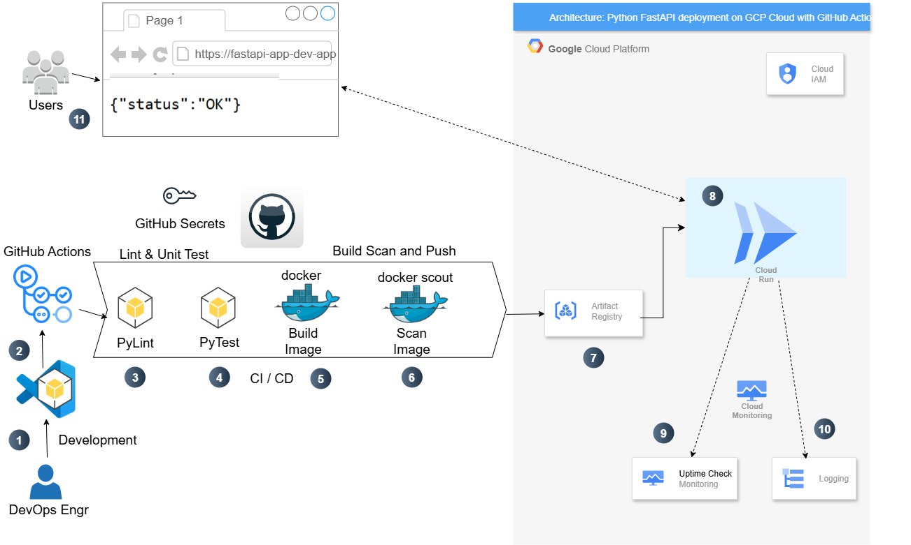
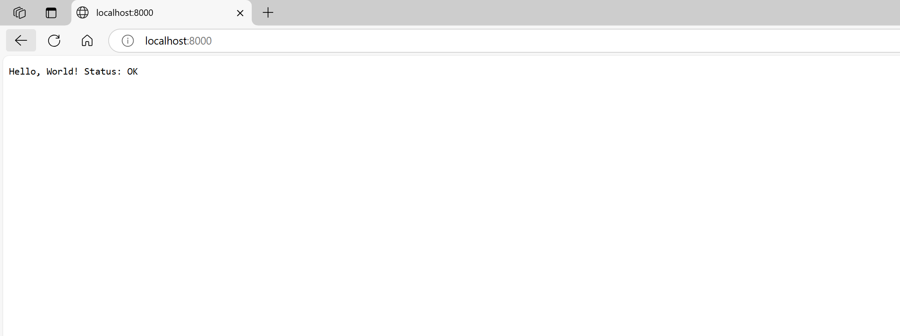
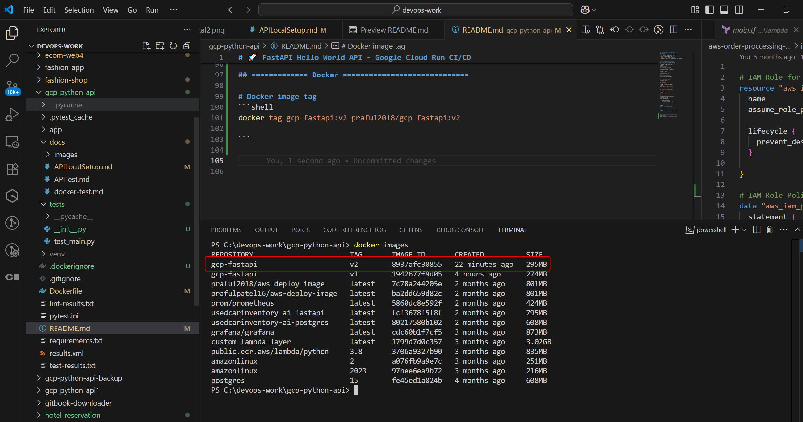
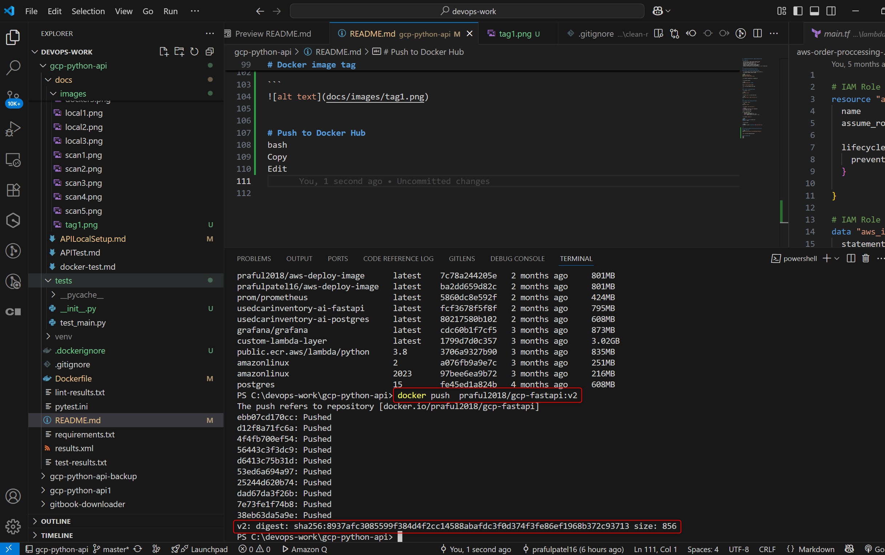
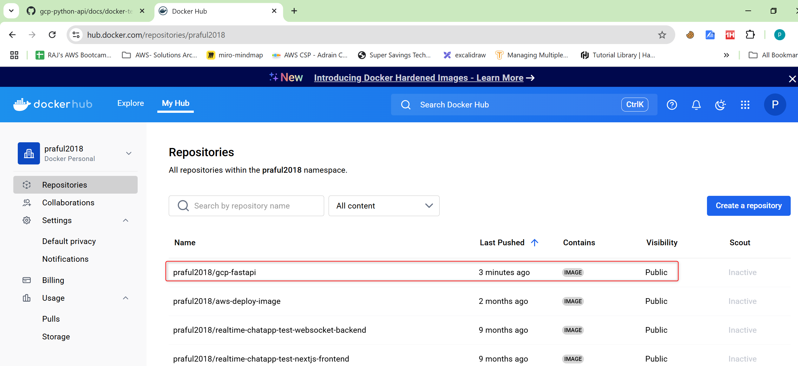
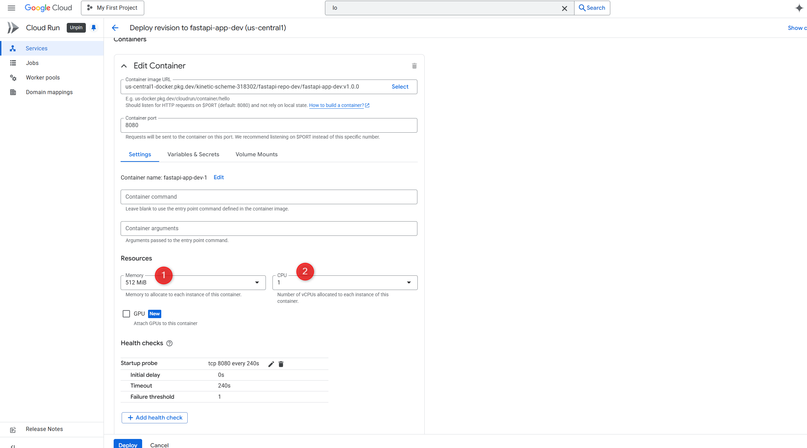
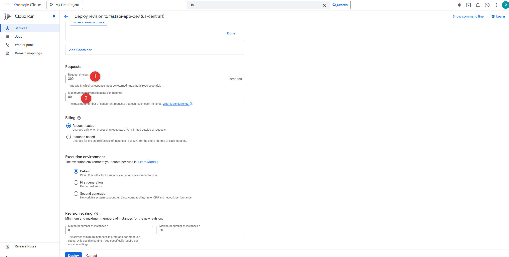
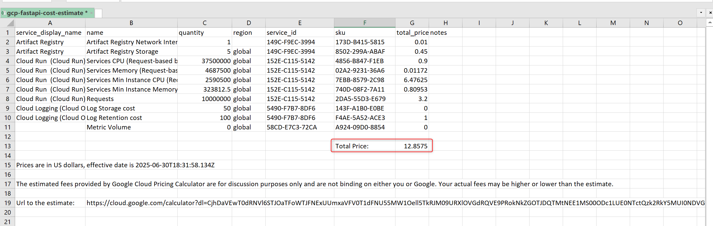

# FastAPI Deployment to Google Cloud Platform (GCP)

## Objective

This project demonstrates how to securely build, test, containerize, and deploy a Python FastAPI web API to Google Cloud Run using GitHub Actions. It includes security scanning, CI/CD automation, uptime monitoring, and cost-effective architecture.

---

## Diagram




## 1. Technology Stack

- **Framework Setup**: FastAPI, Python  
  👉 [Click here to follow: 0.Framework Setup](docs/0.framework_setup.md)

- **Containerization**: Docker with multi-stage builds  
  👉 [Click here to follow: 1.containerization_app](docs/1.containerization_app.md)

- **Security**: Docker Scout (vulnerability scanning)

- **Registry**: Google Artifact Registry

- **Deployment**: Google Cloud Run (fully managed)

- **Monitoring**: Google Cloud Monitoring (Uptime Checks, Logs)

- **CI/CD**: GitHub Actions (triggered on `main` branch push)  
  👉 [Click here to follow: 2.CICD-deployment](docs/2.CICD-deployment.md)


## ✅ Tools and Technologies

| Area                     | Tool/Service              |
|--------------------------|---------------------------|
| **CI/CD Pipeline**       | GitHub Actions            |
| **Secrets Management**   | GitHub Secrets            |
| **Cloud Platform**       | Google Cloud Platform     |
| **Deployment Service**   | Cloud Run                 |
| **Containerization**     | Docker                    |
| **Testing Framework**    | Pytest                    |
| **Linting Tool**         | Pylint                    |
| **Image Scanning**       | Docker Scout              |
| **Artifact Storage**     | Google Artifact Registry  |
| **Monitoring**           | Cloud Monitoring (Uptime, Logs) |


## ✅ Step-by-Step Implementation Checklist

### 🧱 Step 1: Local Setup and Hello World API

- [x] Create Python virtual environment and activate it
- [x] Install FastAPI, Uvicorn, Httpx

```bash
python3 -m venv venv
source venv/bin/activate
pip install fastapi uvicorn httpx
````

* [x] Create a simple API in `app/main.py`

```

# 📘 API Setup and Testing - Local Environment

## ✅ API Setup in Local Environment

- Ensure required dependencies and runtime (e.g., Node.js, Python) are installed
- Navigate to your project directory
- Run the API using the appropriate command:
  
- For Python: `uvicorn app.main:app --reload`
`
- Terminal output confirms the API is running locally (see below)


- Changed project structure


* [x] Run API locally




---

## 🔍 Testing the API in a Browser

- Open your web browser
- Enter the API endpoint URL (e.g., `http://localhost:3000` or `http://127.0.0.1:8000`)
- The expected JSON or text output will be displayed


---

## ✅ Summary

- API successfully started on the local machine
- Endpoint verified via browser test
- Ready for integration or further development

---

### 🔍 Step 2: Linting with Pylint

* [x] Install `pylint`

```bash
pip install pylint
```

* [x] Run `pylint` on source and tests

```bash
pylint app tests/ | tee lint-results.txt
```

---

### 🧪 Step 3: Unit Testing with Pytest

* [x] Install `pytest`

```bash
pip install pytest
```

* [x] Create `tests/test_main.py`

```python
from fastapi.testclient import TestClient
from app.main import app

client = TestClient(app)

def test_read_root():
    response = client.get("/")
    assert response.status_code == 200
    assert response.json() == {"status": "ok"}
```

* [x] Create `pytest.ini`:

```ini
[pytest]
addopts = -v --junitxml=results.xml
testpaths = tests
```

* [x] Run tests:

```bash
PYTHONPATH=. pytest --color=yes | tee test-results.txt
```

---


- **Containerization**: Docker with multi-stage builds

## ============= Docker =============================

# Docker image tag
```shell
docker tag gcp-fastapi:v2 praful2018/gcp-fastapi:v2

```



# Push to Docker Hub to test

```shell
docker push praful2018/gcp-fastapi:v2

```





## 2. Setup Overview

### Build Phase (CI):
- Run `pylint` to validate code quality (min score: 9.0)
- Run `pytest` for unit tests
- Build Docker image using secure multi-stage approach (Alpine-based)
- Scan image with Docker Scout for known CVEs

### Deploy Phase (CD):
- Push image to Google Artifact Registry
- Deploy to Google Cloud Run (with public access)
- Retrieve Cloud Run URL and export as environment variable
- Configure uptime check using Google Monitoring API
- Enable structured logging for observability

---

## 3. IAM Roles Required (Service Account: `github-actions-deployer@...`)

| Role Name                                      | Purpose                                      |
|-----------------------------------------------|----------------------------------------------|
| Artifact Registry Writer                       | Push images to Artifact Registry             |
| Cloud Run Admin                                | Deploy/update Cloud Run services             |
| Logs Writer                                    | Write logs for observability                 |
| Monitoring Uptime Check Configuration Editor   | Configure monitoring uptime probes           |
| Service Account User                           | Impersonate service account during pipeline  |

---


## 4. Cost Estimate

| Resource               | Tier                    | Estimated Cost (per month)  |
|------------------------|-------------------------|------------------------------|
| Cloud Run              | Always Free (up to 2M requests/month) | $0                       |
| Artifact Registry      | 0.5 GB stored            | ~$0.10                       |
| Cloud Logging          | Free up to 50GB          | $0                           |
| Monitoring Uptime Check| First 100 checks free    | $0                           |
| GitHub Actions         | Included in Free Tier    | $0          

- **GitHub Actions: Unlimited for public repos • 2,000 minutes for private repos (Free Plan)

> Total Monthly Estimate: **$0 – $1**, if within free tier limits.





Cost Summary
The current architecture is highly cost-effective, designed to run for virtually free ($0-1 per month) by fully leveraging the "Always Free" tiers of Google Cloud and GitHub Actions. This is ideal for development, testing, and low-traffic applications.
However, should the application need to scale to handle more latency-sensitive traffic, the operational cost is projected to be a predictable $12 to $15 per month. This increase is primarily driven by the most common scaling adjustment: configuring the Cloud Run service to keep a single instance running continuously (--min-instances=1) to eliminate cold starts.


# 💰 Cost Summary

The current architecture is **highly cost-effective**, designed to operate within the **"Always Free"** tiers offered by Google Cloud and GitHub Actions. This allows the application to run at **virtually no cost ($0–$1 per month)**, making it ideal for:

- ✅ Development
- ✅ Testing
- ✅ Low-traffic production environments

---

## 📈 Projected Cost for Scaling

If the application needs to scale for **latency-sensitive workloads** or higher traffic, the cost may increase slightly. This is mainly due to configuring **Cloud Run** to maintain warm instances, avoiding cold starts.

### 🔧 Example Configuration:
```bash
--min-instances=1
```
💵 Estimated Monthly Cost (with Scaling):

| Feature                     | Cost Impact                                               |
| --------------------------- | --------------------------------------------------------- |
| Cloud Run (min-instances=1) | \$12 to \$15/month                                        |
| GitHub Actions              | Still within free tier (2000 mins/month for public repos) |



Click here to follow: [Cost Estimate](/docs/gcp-fastapi-cost-estimate.csv)

---

## 5. Design Decisions

- **Cloud Run (fully managed)** was selected for:
  - No server management
  - Auto-scaling based on HTTP traffic
  - Free tier benefits
  - Integrated logging and monitoring

- **Docker Alpine Image** used for:
  - Smaller image size (~35–45MB)
  - Fewer attack vectors
  - Faster cold starts

- **GitHub Actions** chosen for:
  - Seamless integration with repo
  - Secret management
  - Flexible CI/CD pipeline configuration

- gcloud CLI
  A command-line tool to interact with Google Cloud resources directly.
  Best suited for quick setup, one-off resource provisioning, or local development automation.

## ⚖️ Decision Summary: Why gcloud CLI over Terraform?

For this project, `gcloud CLI` was selected over Terraform due to its simplicity and speed in setting up and managing Google Cloud resources. Since the application is lightweight, single-environment, and designed for fast prototyping and CI/CD deployment, `gcloud CLI` offered:

- ✅ Quick iteration and deployment with fewer files and no state management
- ✅ Seamless integration into GitHub Actions workflows
- ✅ Ideal support for minimal infrastructure (e.g., Cloud Run, Artifact Registry)

Terraform is ideal for complex, multi-environment setups or where full infrastructure as code is required. However, for this scoped project, `gcloud CLI` aligns better with the goals of agility, clarity, and minimal overhead.


---

## 6. CI/CD Pipeline (GitHub Actions)

**Trigger**: On `master` branch push

### Steps:
1. Checkout code
2. Install dependencies
3. Lint using `pylint`
4. Test using `pytest`
5. Build Docker image
6. Scan image with Docker Scout
7. Push image to Artifact Registry
8. Deploy to Cloud Run
9. Fetch Cloud Run URL
10. Create Uptime Check
11. Output deployed URL in job summary

---

## 7. Uptime & Observability

- Configured `/hellowrold` endpoint for basic service checks.
- Created uptime check with:
  - Protocol: HTTPS
  - Path: `/helloworld`
  - Interval: 1 min
- Logs collected automatically by Cloud Run and stored in Cloud Logging.

---

## 8. Final Output

- **Deployed URL**: Captured and logged via GitHub Actions
- **Monitoring**: Active with alerts configurable via Cloud Monitoring
- **Docker Image**: Available in Artifact Registry under project scope

---

## Conclusion

This deployment framework is secure, automated, cost-effective, and production-ready. It provides a strong foundation for extending to multi-environment pipelines, secret management, and performance monitoring.

