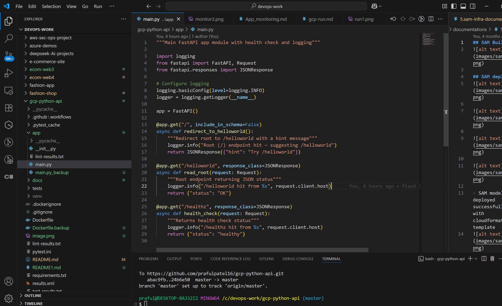
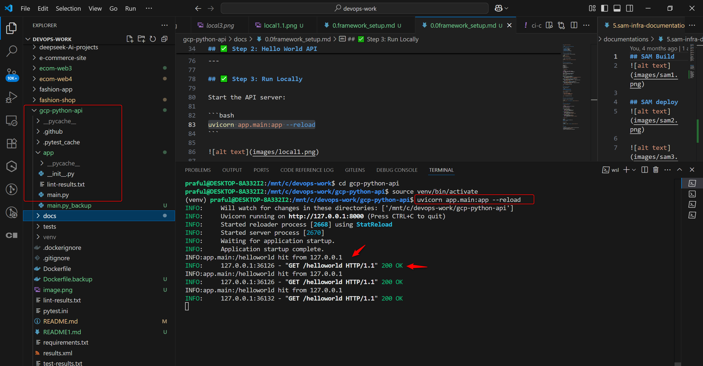
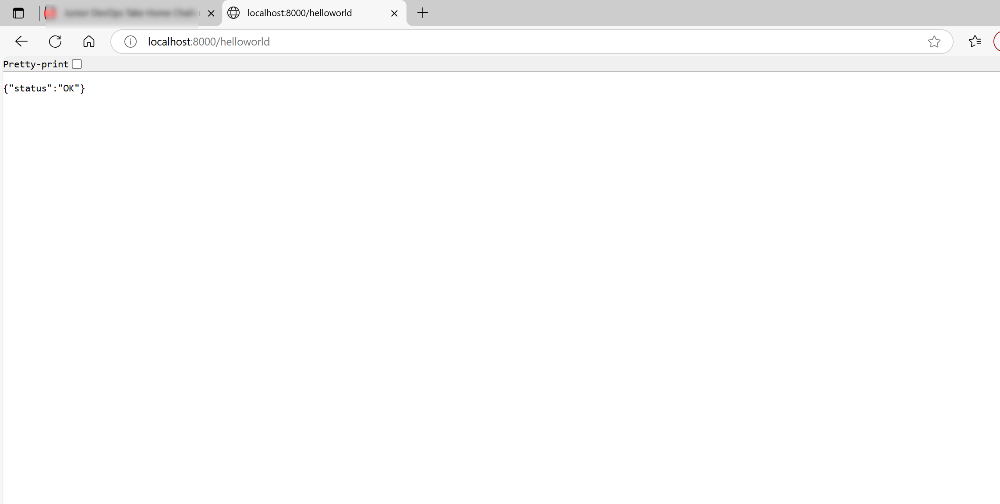

### 0.framework_setup

````md
# FastAPI Local Setup and Testing Guide

## 🛠️ Technology Stack

- **Language**: Python 3.12
- **Framework**: FastAPI
- **Web Server**: Uvicorn
- **Linting Tool**: Pylint
- **Testing Framework**: Pytest

---

## ✅ Step 1: Environment Setup

1. Create and activate a virtual environment:

```bash
python3 -m venv venv
source venv/bin/activate
````

2. Install required packages:

```bash
pip install fastapi uvicorn httpx pylint pytest
```

---

## ✅ Step 2: Hello World API

Create the following file structure:

```
project-root/
├── app/
│   └── main.py
├── tests/
│   └── test_main.py
├── pytest.ini
```

**`app/main.py`**

```python
from fastapi import FastAPI, Request
from fastapi.responses import JSONResponse
import logging

logging.basicConfig(level=logging.INFO)
logger = logging.getLogger(__name__)

app = FastAPI()

@app.get("/", include_in_schema=False)
async def redirect_to_helloworld():
    logger.info("Root (/) endpoint hit — suggesting /helloworld")
    return JSONResponse({"hint": "Try /helloworld"})

@app.get("/helloworld", response_class=JSONResponse)
async def read_root(request: Request):
    logger.info("/helloworld hit from %s", request.client.host)
    return {"status": "OK"}

@app.get("/healthz", response_class=JSONResponse)
async def health_check(request: Request):
    logger.info("/healthz hit from %s", request.client.host)
    return {"status": "healthy"}
```


---

## ✅ Step 3: Run Locally

Start the API server:

```bash
uvicorn app.main:app --reload
```




Access in browser:

* `http://127.0.0.1:8000/`
* `http://127.0.0.1:8000/helloworld`
* `http://127.0.0.1:8000/healthz`




---

## ✅ Step 4: Lint the Code with Pylint

Use the following command to lint your main app and test files, showing output in the terminal and saving it to a file:

```bash
pylint app.py tests/ | tee lint-results.txt
```

* `app.py` is your FastAPI source file
* `tests/` is your test folder
* `tee` shows output and saves it to `lint-results.txt`

---


Run Pylint to check for code quality:

```bash
pylint app tests/ --fail-under=9.0 | tee lint-results.txt
```

## Sample Output (lint-results.txt)

```
************* Module app
app.py:1:0: C0114: Missing module docstring (missing-module-docstring)
...
Your code has been rated at 9.00/10
```


---

## ✅ Step 5: Add Unit Tests

**`tests/test_main.py`**

```python
from fastapi.testclient import TestClient
from app.main import app

client = TestClient(app)

def test_redirect_root():
    response = client.get("/")
    assert response.status_code == 200
    assert "hint" in response.json()

def test_helloworld():
    response = client.get("/helloworld")
    assert response.status_code == 200
    assert response.json() == {"status": "OK"}

def test_health_check():
    response = client.get("/healthz")
    assert response.status_code == 200
    assert response.json() == {"status": "healthy"}
```

**`pytest.ini`**

```ini
[pytest]
addopts = -v --junitxml=results.xml
testpaths = tests
```

Run the tests:

```bash
PYTHONPATH=. pytest --color=yes | tee test-results.txt
```

---

## ✅ Summary

* FastAPI API is structured, running, and verified locally
* Code quality enforced via `pylint`
* Unit tests pass with `pytest`
* Ready for containerization and deployment

```

