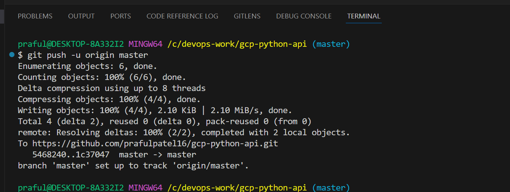

# 📘 CI/CD Pipeline Execution Overview

This document outlines the automated CI/CD pipeline setup for deploying a Python FastAPI application to Google Cloud Run using GitHub Actions. Each step includes visual references from the actual workflow run.

---

## ✅ Tools and Technologies

| Area                     | Tool/Service              |
|--------------------------|---------------------------|
| **CI/CD Pipeline**       | GitHub Actions            |
| **Secrets Management**   | GitHub Secrets            |
| **Cloud Platform**       | Google Cloud Platform     |
| **Deployment Service**   | Cloud Run                 |
| **Containerization**     | Docker                    |
| **Testing Framework**    | Pytest                    |
| **Linting Tool**         | Pylint                    |
| **Image Scanning**       | Docker Scout              |
| **Artifact Storage**     | Google Artifact Registry  |
| **Monitoring**           | Cloud Monitoring (Uptime, Logs) |

---

## 🚀 Pipeline Steps

### 1. Checkout Source Code

The pipeline starts by pulling the latest code from the repository to the GitHub Actions runner.

> Ensures the runner has all files required for build and deployment.

  

---

### 2. Install Dependencies

Installs all required Python dependencies listed in `requirements.txt` and additional tools for testing and linting.

> Prepares the environment for code validation and testing.

---

### 3. Lint Code Using `pylint`

`pylint` checks for code style issues and static errors in both `app/` and `tests/` directories.

> Helps enforce coding standards and catch bugs early.

---

### 4. Run Unit Tests Using `pytest`

Runs unit tests to ensure the API behaves as expected and fails the pipeline if tests don't pass.

> Guarantees functional integrity before packaging the application.

---

### 5. Build Docker Image

Builds a secure and slim Docker image using a multi-stage `Dockerfile`.

> Produces a production-ready image with only runtime essentials.

---

### 6. Scan Image with Docker Scout

Performs vulnerability scanning of the Docker image to identify any known security flaws.

> Ensures the image is safe before deployment.

---

### 7. Push Image to Google Artifact Registry

Pushes the Docker image to Artifact Registry in the specified GCP project and region.

> Provides a secure and centralized image repository.

  
  

---

### 8. Deploy to Cloud Run

Deploys the Docker image to a fully managed Cloud Run service.

> Automatically scales based on traffic and abstracts infrastructure management.

---

### 9. Fetch Cloud Run Service URL

Retrieves the live service URL after deployment for further monitoring and testing.

> This URL is used in health checks and frontend integration.

---

### 10. Cloud Logging

All application logs are collected by Google Cloud Logging for observability and debugging.

> Helps track runtime errors and user activity.

---

### 11. Create Uptime Check

Sets up a Cloud Monitoring uptime check to continuously validate that the application is running.

> Sends alerts if the deployed API goes down or fails to respond.

## 12. Test App URL

---

## ✅ Summary

- Each step is automated and runs on every push to the `master` branch.
- Code quality, security, and runtime reliability are all verified.
- Deployment to Cloud Run is fast, secure, and scalable.

