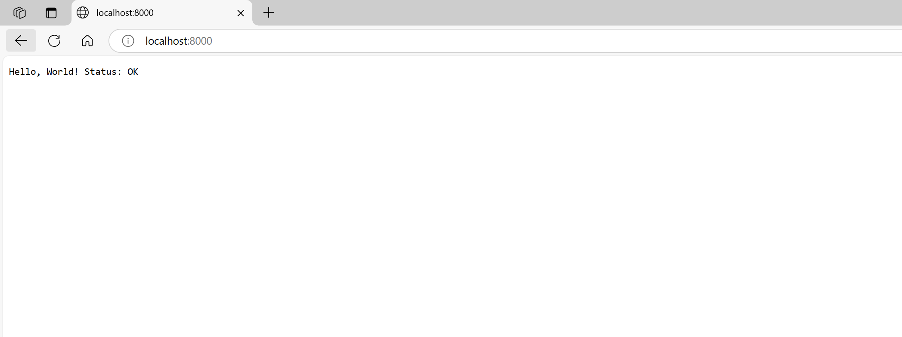

# 📘 API Setup and Testing - Local Environment

## ✅ API Setup in Local Environment

- Ensure required dependencies and runtime (e.g., Node.js, Python) are installed
- Navigate to your project directory
- Run the API using the appropriate command:
  - For Node.js: `npm start` or `node app.js`
  - For Python: `uvicorn main:app --reload`
- Terminal output confirms the API is running locally (see below)

- Changed project structure

---

## 🔍 Testing the API in a Browser

- Open your web browser
- Enter the API endpoint URL (e.g., `http://localhost:3000` or `http://127.0.0.1:8000`)
- The expected JSON or text output will be displayed

---

## ✅ Summary

- API successfully started on the local machine
- Endpoint verified via browser test
- Ready for integration or further development
