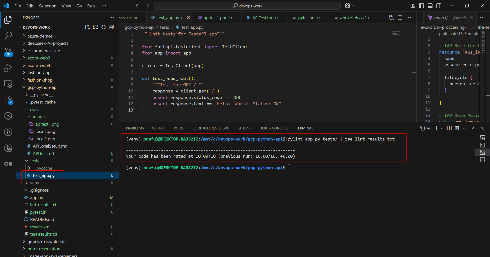
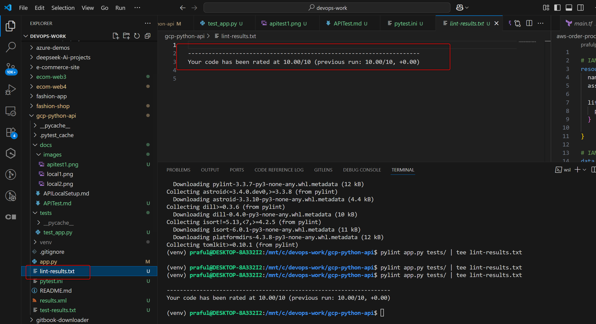
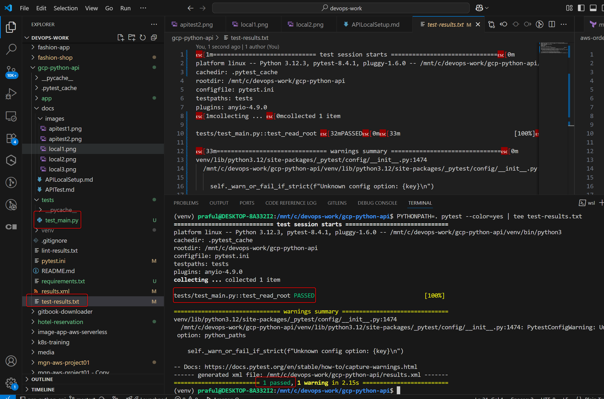

# 🧹 Pylint Setup and Usage Guide

### ============================== Pylint ======================================

This document explains how to configure and run `pylint` & `pytest` to check for code quality in your Python FastAPI project.

---

## ✅ 1. Install Pylint

Make sure you're inside your virtual environment (`venv`), then run:

```bash
pip install pylint
````

---

## ✅ 2. Generate a Pylint Configuration File (Optional)

You can generate a default configuration file for customization:

```bash
pylint --generate-rcfile > .pylintrc
```

Common adjustments in `.pylintrc`:

* Ignore missing docstring warnings:

```ini
[MESSAGES CONTROL]
disable=C0114,C0115,C0116
```

* Adjust max line length:

```ini
[FORMAT]
max-line-length=88
```

---

## ✅ 3. Run Pylint on App and Test Files

Use the following command to lint your main app and test files, showing output in the terminal and saving it to a file:

```bash
pylint app.py tests/ | tee lint-results.txt
```

* `app.py` is your FastAPI source file
* `tests/` is your test folder
* `tee` shows output and saves it to `lint-results.txt`

---




## ✅ 4. Sample Output (lint-results.txt)

```
************* Module app
app.py:1:0: C0114: Missing module docstring (missing-module-docstring)
...
Your code has been rated at 9.00/10
```

---

## ✅ 5. Tips for Clean Code

* Fix high-priority issues (e.g., unused imports, wrong indentation)
* Use docstrings to suppress missing-docstring warnings
* Review and refactor based on suggestions to maintain high code quality

---

## ✅ 6. Add to Git Ignore

You can ignore the lint results file in `.gitignore`:

```
lint-results.txt
```

---


```
```

### ================= PyTEST ==============================

Here is a clean, professional `.md` documentation file for `pytest` setup and usage, written in plain text:

---

````markdown
# 🧪 Pytest Setup and Usage Guide

This document provides a structured overview for setting up and running unit tests using `pytest` in a Python project.

---

## ✅ 1. Install Pytest

Ensure you're inside your virtual environment (`venv`), then run:

```bash
pip install pytest
````

For FastAPI testing, also install:

```bash
pip install httpx
```

---

## ✅ 2. Project Structure Example

```
gcp-python-api/
├── app/
│   ├── __init__.py
│   └── main.py
├── tests/
│   └── test_main.py
├── pytest.ini
├── requirements.txt
```

---

## ✅ 3. Sample Test File: `tests/test_main.py`

```python
from fastapi.testclient import TestClient
from app.main import app

client = TestClient(app)

def test_read_root():
    response = client.get("/")
    assert response.status_code == 200
    assert response.text == "Hello, World! Status: OK"
```

---

## ✅ 4. Create a Pytest Config File (`pytest.ini`)

```ini
# pytest.ini
[pytest]
addopts = -v --junitxml=results.xml
testpaths = tests
```

---

## ✅ 5. Running Tests

Use the following command from the root directory:

```bash
PYTHONPATH=. pytest --color=yes | tee test-results.txt
```

* `PYTHONPATH=.` ensures the `app` package is discoverable
* `--color=yes` keeps the green/red output
* `tee` displays results in terminal and saves them to a file

---

## ✅ 6. Output Files

* `test-results.txt`: Plain text results with terminal color codes
* `results.xml`: Machine-readable test report (useful in CI/CD)

---



## ✅ 7. Test Output Example

```
tests/test_main.py::test_read_root PASSED                                [100%]
```

---

## ✅ 8. Tips

* All test filenames should start with `test_`
* Test functions must also start with `test_`
* Use `pytest -k test_name` to run specific tests
* Use `pytest --maxfail=1` to stop after first failure

---

## 🧼 Optional: Add Test Command Script

Create a shell script `run-tests.sh`:

```bash
#!/bin/bash
export PYTHONPATH=.
pytest --color=yes --junitxml=results.xml | tee test-results.txt
```

Make it executable:

```bash
chmod +x run-tests.sh
./run-tests.sh
```

---


