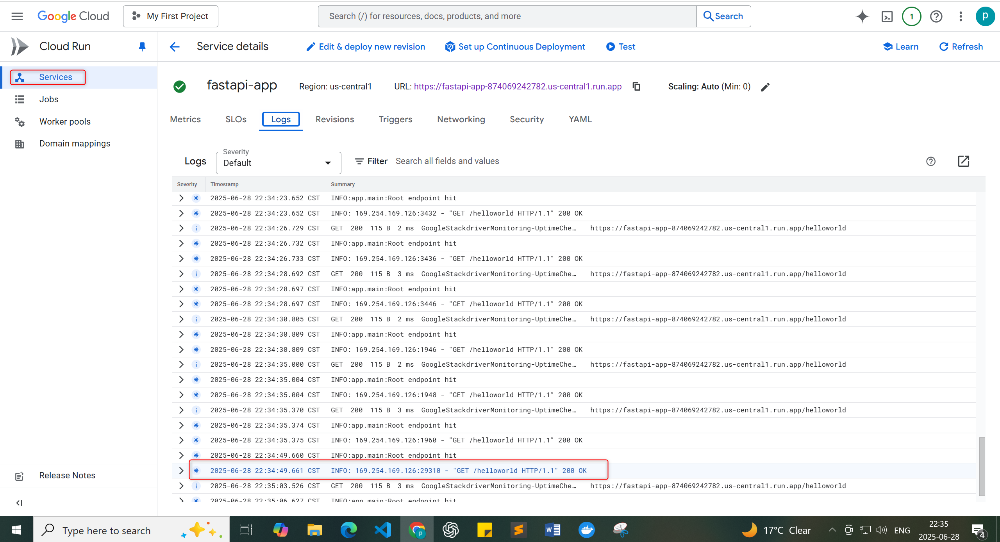
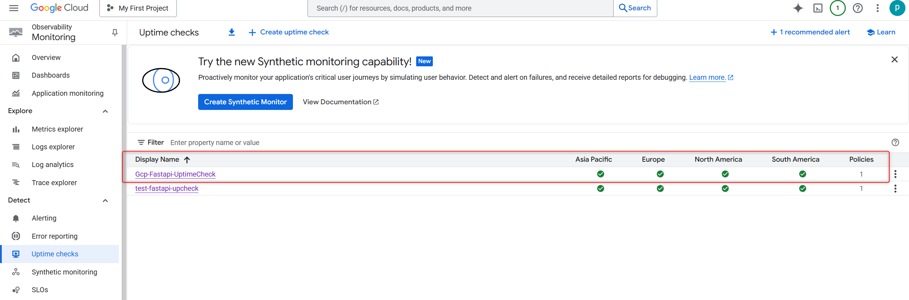
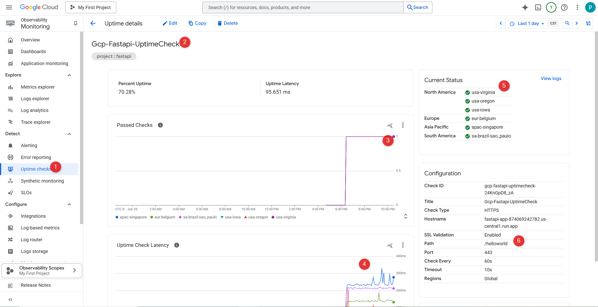

# 📈 FastAPI Cloud Run Observability Setup

## 🎯 Objective of Uptime Check

The Uptime Check helps ensure your app is online and responsive by:

- ✅ Periodically sending HTTP(S) requests (e.g. every 60 seconds)
- ✅ Validating HTTP response code (expected: `200 OK`)
- ✅ Measuring latency and availability
- ✅ Triggering alerts if the app fails from any region

---

## ✅ 1. Enable Cloud Logging

**Cloud Run automatically enables Cloud Logging** if the following conditions are met:

- Deployment is done via `gcloud run deploy` or Google Cloud Console
- Your app logs to `stdout` or `stderr` using Python’s `print()` or `logging` modules

## ✅ 2. Set Up Uptime Checks (Google Cloud Monitoring)

🔧 Steps via Console
Navigate to: Google Cloud Console > Monitoring > Uptime Checks

Click Create Uptime Check

Fill in the following fields:

Field	Value
Title	FastAPI Health Check
Protocol	HTTPS
Hostname	fastapi-app-874069242782.us-central1.run.app
Path	/healthz
Port	443
Frequency	1 minute
Timeout	10 seconds
Region	Global (recommended)

