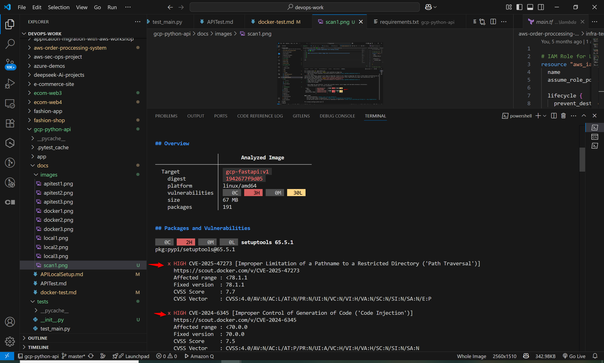
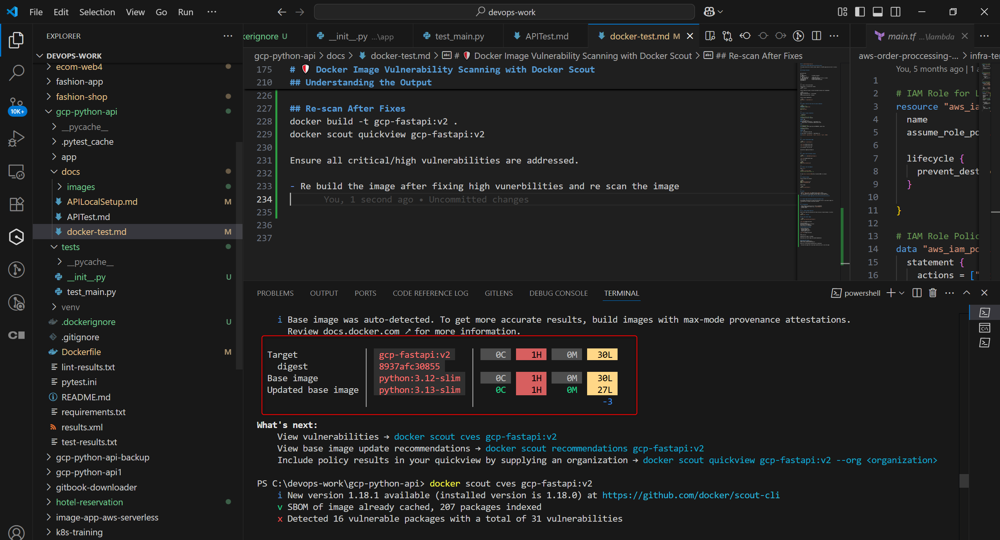
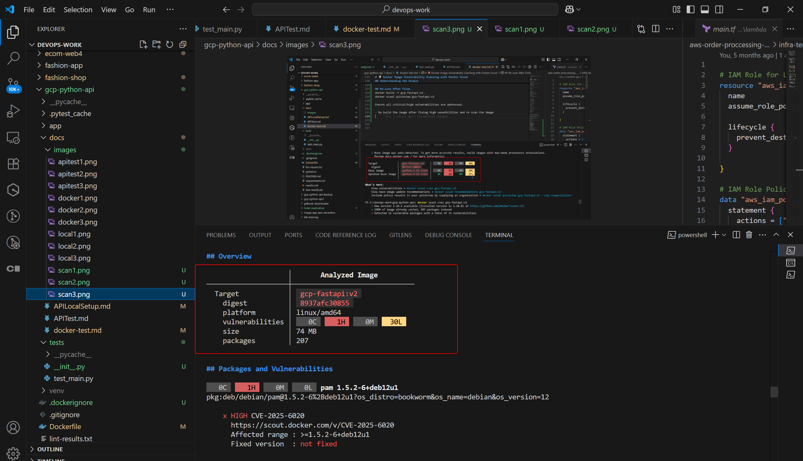

### 📄 `docker-fastapi-local.md`

# Dockerizing a FastAPI Application and Testing Locally

This guide outlines how to build a Docker image for a FastAPI application and test it locally.

---

## 🧱 Project Structure

```

gcp-python-api/
│
├── app/
│   └── main.py              # FastAPI entrypoint
├── tests/
│   ├── test\_main.py         # Unit test file
│   └── **init**.py          # Required to recognize tests as a module
├── requirements.txt         # Python dependencies
├── Dockerfile               # Docker build instructions
└── README.md

````

---

## ⚙️ Step 1: Set Up Environment

Ensure Docker is installed and running:
```bash
docker --version
````

Install Python and create a virtual environment (optional but recommended):

```bash
python -m venv venv
source venv/bin/activate   # Linux/macOS
# OR
venv\Scripts\activate.bat  # Windows
```

Install project dependencies:

```bash
pip install -r requirements.txt
```

---

## 🧪 Step 2: Run Unit Tests and Lint Locally (Optional)

```bash
# Run unit tests
PYTHONPATH=. pytest tests

# Lint code
pylint app tests
```

---

## 🐳 Step 3: Create a Dockerfile

```dockerfile
# Dockerfile

# Stage 1: Build, lint, test
FROM python:3.11-slim AS builder

WORKDIR /app

COPY requirements.txt .
RUN pip install --no-cache-dir -r requirements.txt \
    && pip install --no-cache-dir pytest pylint httpx

COPY . .

# Lint and run tests
RUN PYTHONPATH=. pylint app tests && PYTHONPATH=. pytest tests

# Stage 2: Runtime
FROM python:3.11-slim

WORKDIR /app

COPY --from=builder /app /app

RUN pip install --no-cache-dir -r requirements.txt

CMD ["uvicorn", "app.main:app", "--host", "0.0.0.0", "--port", "8080"]

```

---

## 🛠️ Step 4: Build Docker Image

```bash
docker build -t gcp-fastapi:v1 .
```


✅ If successful, you will see:

```
Successfully tagged gcp-fastapi:v1
```

---

## 🚀 Step 5: Run the Container Locally

```bash
docker run -d -p 8080:8080 gcp-fastapi:v1
```


Check the logs:

```bash
docker ps
docker logs <container_id>
```

---

## 🌐 Step 6: Test the Endpoint

Using `curl`:

```bash
curl http://localhost:8080/
# Output: Hello, World! Status: OK
```

Or open [http://localhost:8080](http://localhost:8080) in a browser.

---

## 🧹 Optional Cleanup

Stop and remove the container:

```bash
docker ps
docker stop <container_id>
docker rm <container_id>
```

Remove image:

```bash
docker rmi gcp-fastapi:v1
```

---

## ✅ Notes

* Ensure `tests/__init__.py` exists to fix `pylint` errors.
* Use `AS` (uppercase) in Dockerfile stage naming to avoid warnings.
* For production, you may disable test/lint steps in final Docker build.

### ============== Docker image Scan ======================================


# 🛡️ Docker Image Vulnerability Scanning with Docker Scout

This document outlines how to install and use Docker Scout to scan Docker images for vulnerabilities on Windows using Docker Desktop.

---

## 📦 Prerequisites

- Docker Desktop installed (v4.18 or later recommended)
- A Docker image built locally (e.g., `gcp-fastapi:v1`)
- Internet access

---

## 🔧 1. Install Docker Scout CLI

Docker Scout comes pre-installed with recent versions of Docker Desktop. To confirm:

```bash
docker scout --version

```
## Scan local docker images
 
 ```bash
 docker scout quickview gcp-fastapi:v1

 ```


This will display:
Vulnerabilities grouped by severity
CVE links for more details
Fixed versions (if available)

## Understanding the Output

x HIGH CVE-2025-47273
  Affected package: xyz
  Affected range: <78.1.1
  Fixed version: 78.1.1



---
Take action by:

Upgrading base images or packages

Rebuilding your Docker image with patched dependencies


## Re-scan After Fixes
docker build -t gcp-fastapi:v2 .
docker scout quickview gcp-fastapi:v2

Ensure all critical/high vulnerabilities are addressed.

- Re build the image after fixing high vunerbilities and re scan the image







