**FastAPI Docker Image Workflow on GCP**, including **IAM setup, Artifact Registry creation, Docker image push, and Cloud Run deployment**.

# 🚀 FastAPI App: GCP Deployment Guide with Artifact Registry & Cloud Run

This guide covers:

- ✅ Setting up GCP Project & IAM
- 🗃️ Creating Artifact Registry
- 🐳 Tagging & Pushing Docker Image
- 🚀 Deploying to Cloud Run (Manual)
- 🔐 Security & Best Practices

---

## 1️⃣ Set GCP Project

```bash
gcloud config set project kinetic-scheme-318302
````

This ensures all gcloud commands apply to your project.

---

## 2️⃣ IAM Setup (Least Privilege)

Assign necessary roles for image publishing and deployment:

```bash
# Grant Cloud Run Admin Role
gcloud projects add-iam-policy-binding kinetic-scheme-318302 \
  --member="user:praful9080@gmail.com" \
  --role="roles/run.admin"

# Grant Artifact Registry Writer Role
gcloud projects add-iam-policy-binding kinetic-scheme-318302 \
  --member="user:praful9080@gmail.com" \
  --role="roles/artifactregistry.writer"
```
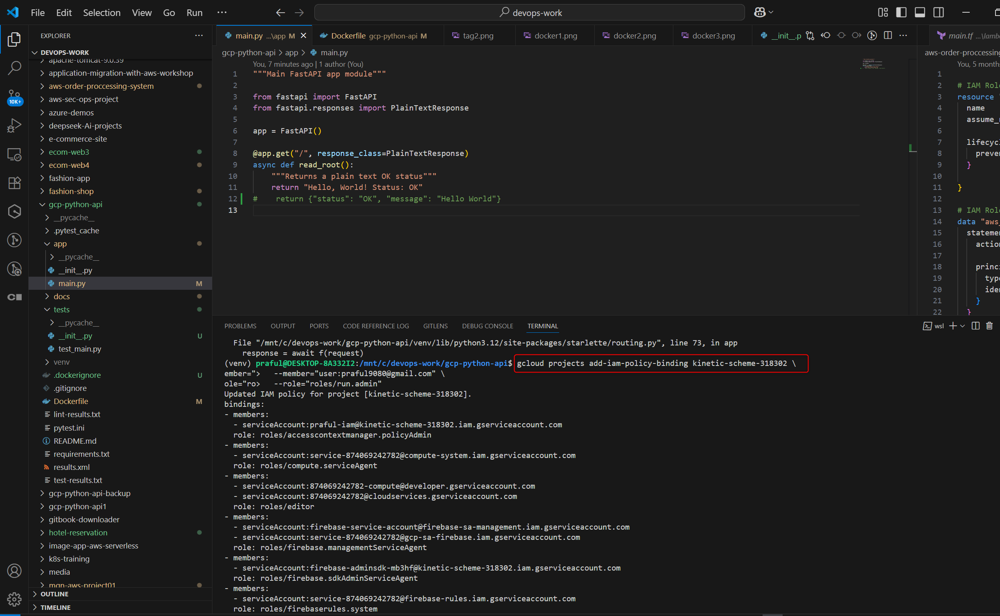

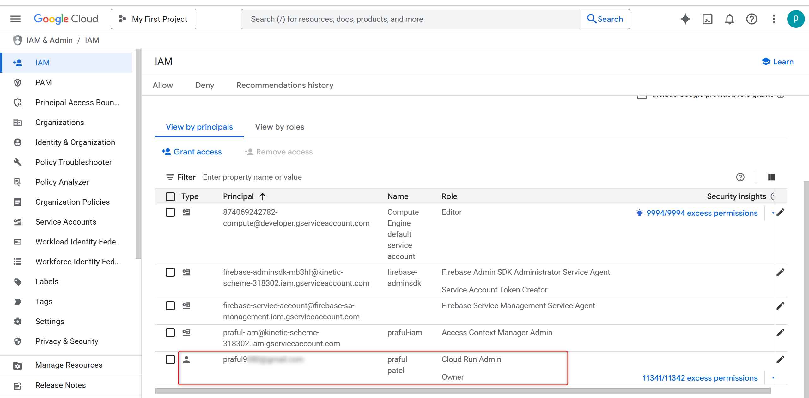

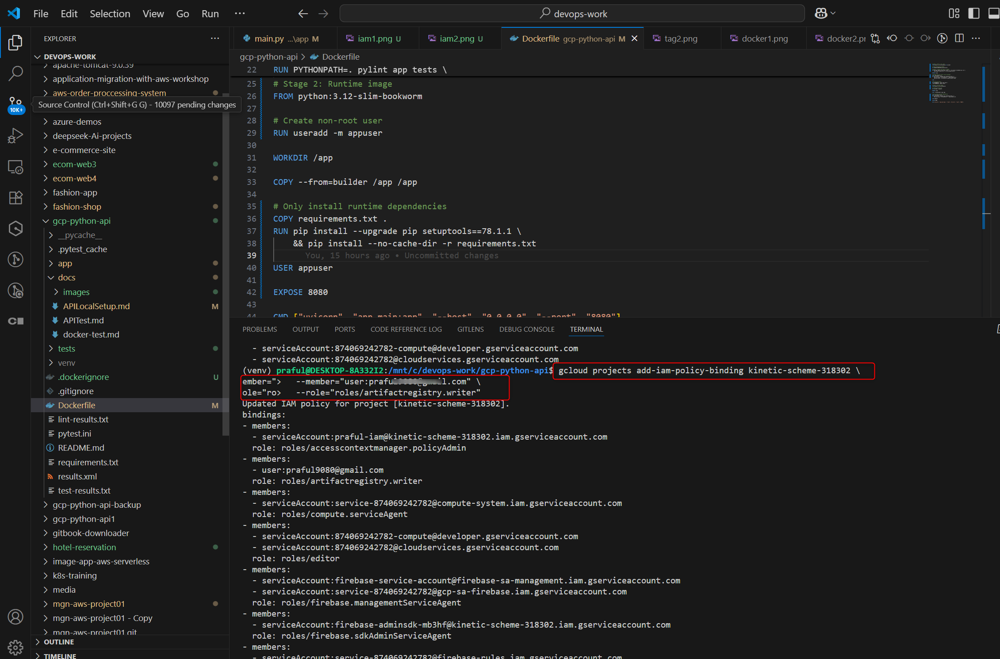

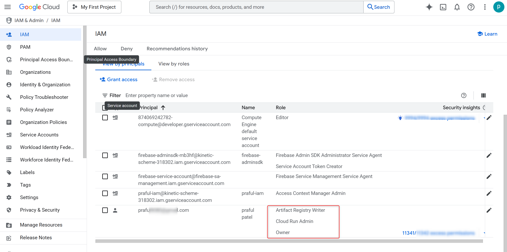

---

## 3️⃣ Enable Required APIs

```bash
gcloud services enable artifactregistry.googleapis.com run.googleapis.com
```

---

## 4️⃣ Create Docker Artifact Registry

```bash
gcloud artifacts repositories create fastapi-repo \
  --repository-format=docker \
  --location=us-central1 \
  --description="FastAPI Docker Images"
```
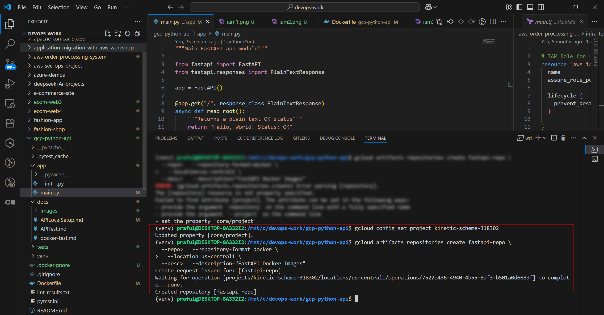

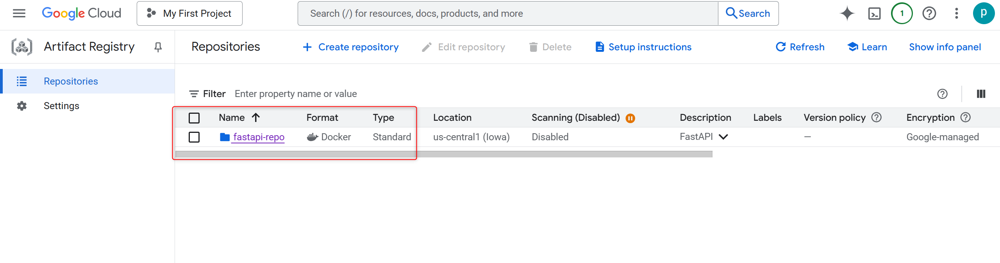

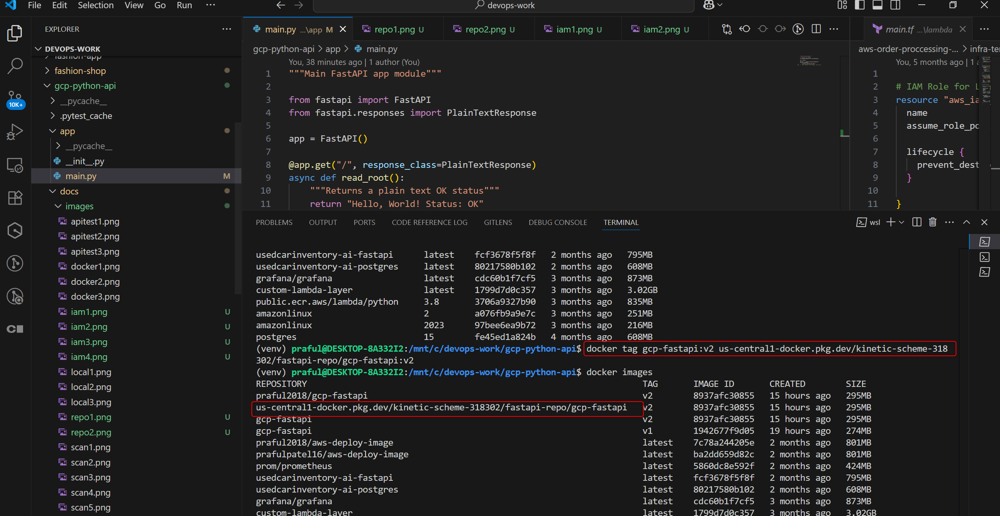
---

## 5️⃣ Docker Image: Tag & Push

### 🧩 Set Environment Variables

```bash
export IMAGE_NAME="gcp-fastapi"
export VERSION="v2"
export PROJECT_ID="kinetic-scheme-318302"
export REGION="us-central1"
export REPO_NAME="fastapi-repo"
export REMOTE_IMAGE="${REGION}-docker.pkg.dev/${PROJECT_ID}/${REPO_NAME}/${IMAGE_NAME}"
```
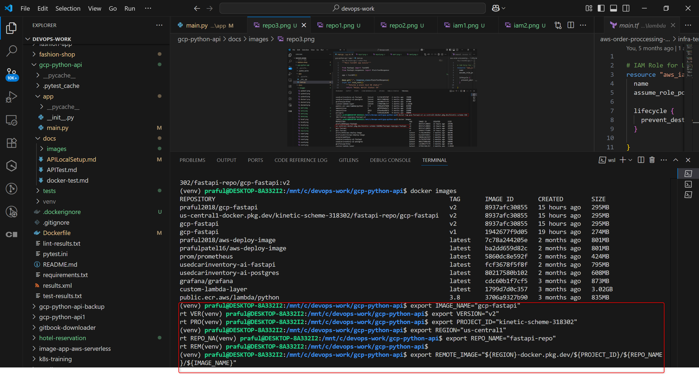

---

### 🏷️ Tag Docker Image

```bash
docker tag ${IMAGE_NAME}:${VERSION} ${REMOTE_IMAGE}:${VERSION}
docker tag ${IMAGE_NAME}:${VERSION} ${REMOTE_IMAGE}:latest
```
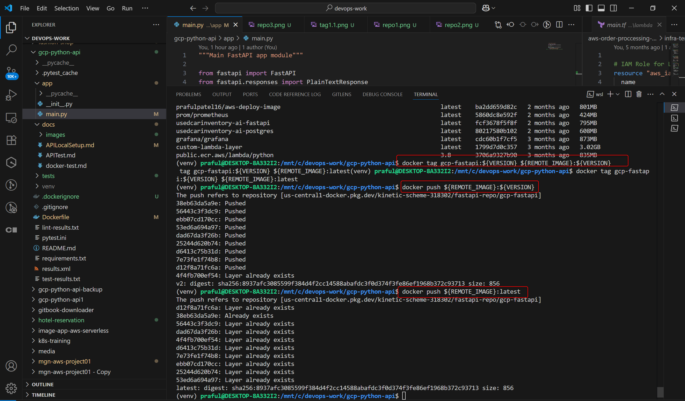


---

### 🔐 Authenticate Docker for Artifact Registry

```bash
gcloud auth configure-docker ${REGION}-docker.pkg.dev
```

> Accept prompt when asked to update Docker config

---

### 📤 Push Tagged Images

```bash
docker push ${REMOTE_IMAGE}:${VERSION}
docker push ${REMOTE_IMAGE}:latest
```
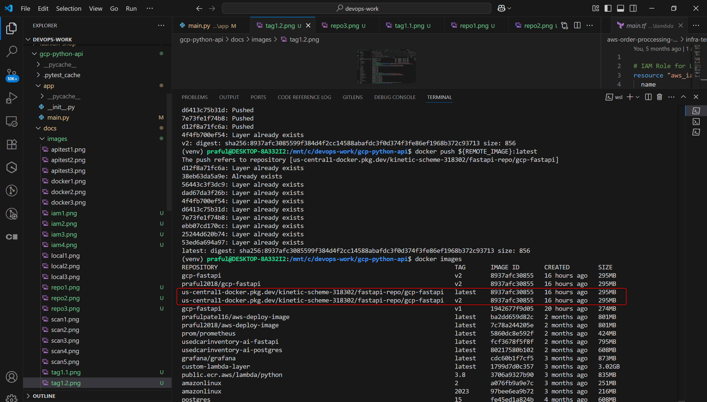

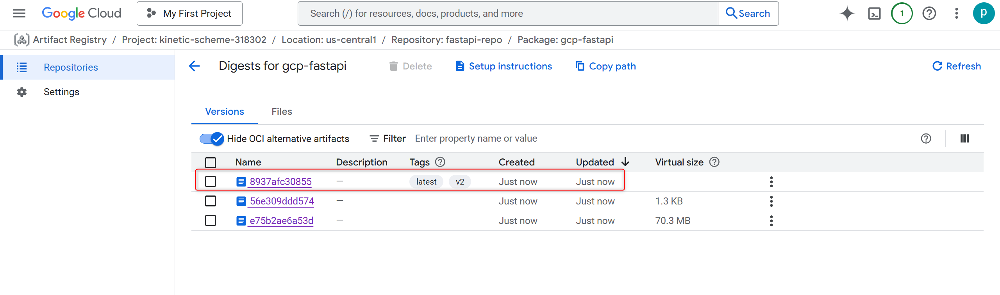
---

### ✅ Verify Image

```bash
gcloud artifacts docker images list ${REMOTE_IMAGE}
```

Or check in the [GCP Console](https://console.cloud.google.com/artifacts/docker/kinetic-scheme-318302/us-central1/fastapi-repo)

---

## 6️⃣ Deploy to Cloud Run (Manual)

```bash
gcloud run deploy fastapi-app \
  --image=${REMOTE_IMAGE}:${VERSION} \
  --platform=managed \
  --region=${REGION} \
  --allow-unauthenticated \
  --port=8080
```
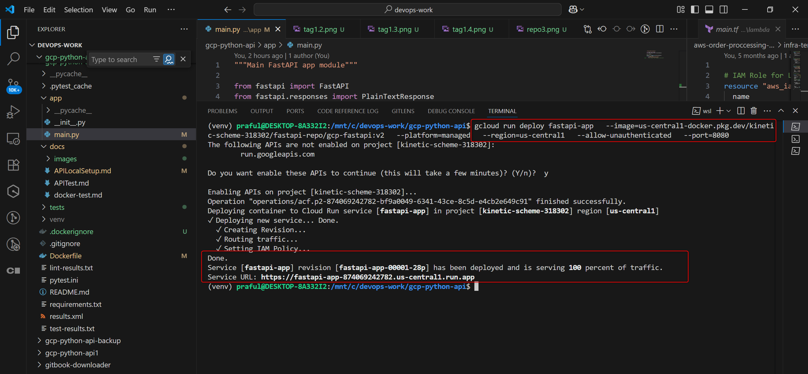

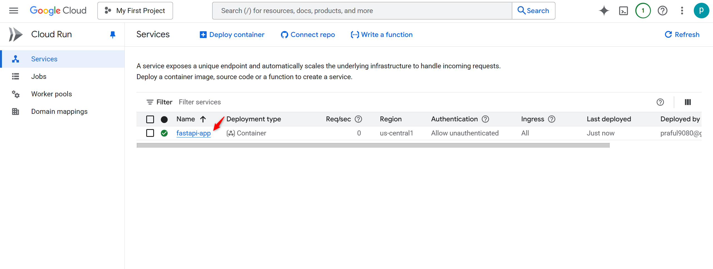

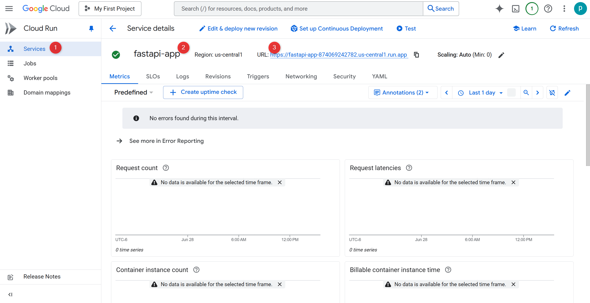

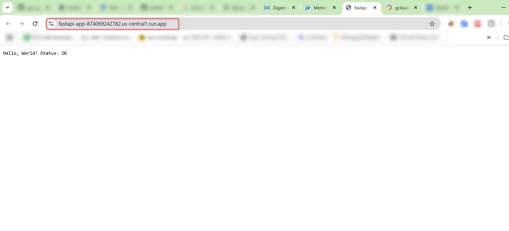

---

## 🔐 Security Best Practices

* Use **non-root Docker image** (e.g., `python:3.12-slim`)
* Avoid plain-text credentials
* Store secrets using:

  * ✅ GitHub Secrets (for CI/CD)
  * ✅ [GCP Secret Manager](https://cloud.google.com/secret-manager)

---

## 📈 Observability

* Logs available via:

  ```bash
  gcloud logs read --limit=50
  ```
* Cloud Run auto-enables **Cloud Logging** and **Monitoring**
* Add a `/health` endpoint for probes

---

## 🧪 Next Step: CI/CD Automation

Use GitHub Actions or Cloud Build to automate:

* ✅ Lint & Unit Tests
* ✅ Docker Build
* ✅ Docker Scout Scan
* ✅ Push to Artifact Registry
* ✅ Auto-deploy to Cloud Run

---


